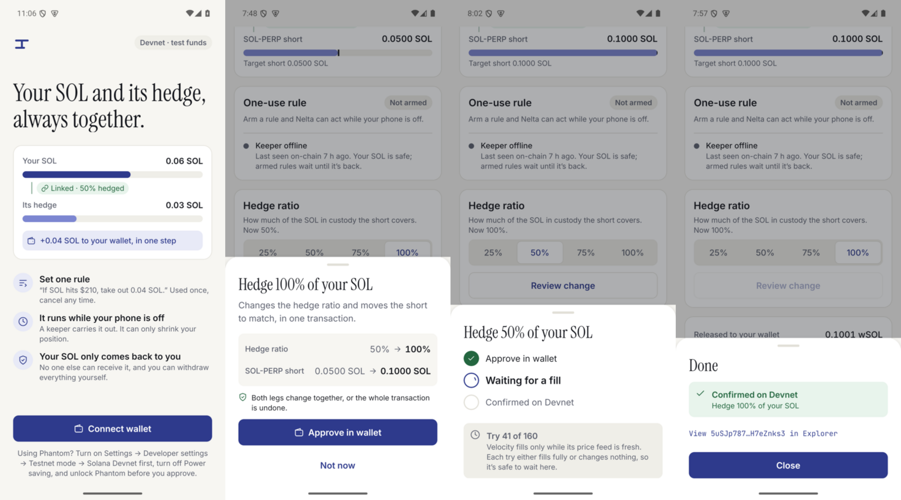
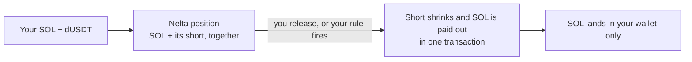
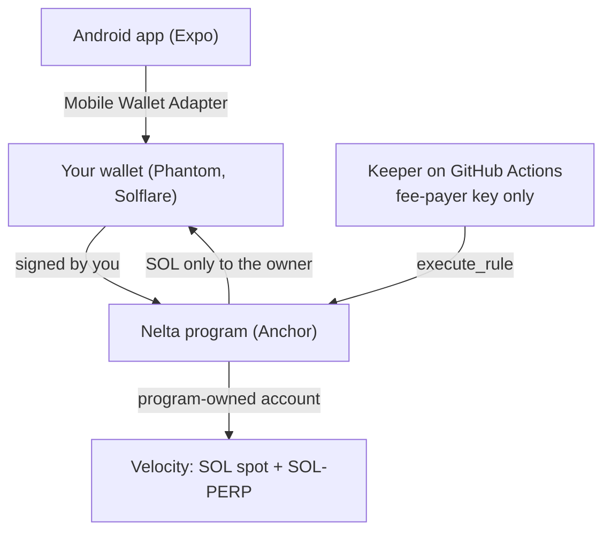

# Nelta

**Nelta keeps your SOL and its hedge together.** Hold SOL, keep part of it hedged with a short, and take SOL out without the two ever getting out of step.

Download: [nelta.apk (Android, latest release)](https://github.com/CryptoZephyr/nelta/releases/latest/download/nelta.apk) · Video: not available yet · Docs: this README and [Devnet evidence](docs/devnet-evidence.md) · Built for: Solana Mobile CLOCK IN



Built with: Solana Mobile Wallet Adapter · Velocity (SOL-PERP) · Anchor · Expo / React Native
Status: working Android app and program on **Solana Devnet** (test funds only)

## The problem

If you hold SOL and hedge it with a short, you run two positions in two places. Sell some SOL and forget the short, and you're now over-hedged, betting against SOL. Close the short first, and you're exposed until you sell. Today you have to keep both in step by hand, every time, and you have to be at your phone to do it.

## What Nelta does

- **One position, two parts.** Your SOL and its short live together. Nelta only lets them change together.
- **Take SOL out in one step.** Release some SOL and the short shrinks by the matching amount in the same transaction. If either part can't happen, nothing happens.
- **Set one rule, then put your phone away.** For example: "If SOL hits $210, take out 0.04 SOL." A keeper carries it out while your phone is off. It only works once, and you can cancel it any time.
- **Leave in one tap.** "Keep my SOL, close the hedge" or "Release all, close the hedge". Either one also cancels an armed rule.
- **See your safety margin.** Home shows how far SOL can move before Velocity would liquidate the short. If something is wrong, it says "Needs attention".
- **Your SOL only ever comes back to you.** No one else can receive it, not the keeper and not Nelta. You can close everything yourself, without the app.

## How it works

1. Connect your wallet (Phantom, Solflare, any Mobile Wallet Adapter wallet) on Devnet.
2. Tap **Get 100 test dUSDT** (collateral for the short, one approval), add SOL, and pick how much to hedge (25–100%).
3. Nelta opens the matching SOL-PERP short on Velocity.
4. Take SOL out yourself, or arm a one-use rule and let the keeper do it while you're away.



## Why Solana

- **Atomic:** the short reduction and the SOL payout are one Solana transaction. Velocity's full-fill orders either fill completely or the whole thing reverts, so the position can't end up half done.
- **Program-owned custody:** the Velocity account belongs to a Nelta program address, not to a person. The rules in the program are the only way to move funds.
- **Mobile Wallet Adapter:** every owner action is signed in your own wallet app on the phone. The keeper never holds your key.

## Try it (about 2 minutes)

1. On an Android phone, download [nelta.apk](https://github.com/CryptoZephyr/nelta/releases/latest/download/nelta.apk) and install it. If Chrome stalls at 100%, use Samsung Internet or Firefox.
2. In Phantom: **Settings → Developer settings → Testnet mode → Solana Devnet**. Turn off Android **Power saving**, and unlock Phantom before you approve.
3. Get some free Devnet SOL from the [faucet](https://faucet.solana.com) (about 0.2 SOL is plenty).
4. Open Nelta, tap **Connect wallet**, and follow the steps on Home: create position → get test dUSDT (Nelta mints it for you) → add SOL → sync hedge. Each step shows "Confirmed on Devnet" with an Explorer link.

No phone? Every step is recorded on Devnet with transaction links in [docs/devnet-evidence.md](docs/devnet-evidence.md).

## What's running

| What | Where |
| --- | --- |
| Nelta program (Devnet) | `9Rk99npYk6kwtEx7MVuq2SWyr1WQQ7f9S9i8mXY4iJ4R` |
| Velocity program (Devnet) | `vELoC1audYbSYVRXn1vPaV8Axoa9oU6BYmNGZZBDZ1P` |
| Hosted keeper | GitHub Actions ([keeper.yml](.github/workflows/keeper.yml)), fee-payer `7kCrKbJ9hAjLFdY26HY5asutdJ4XYadZKajYbu1diqTx` |
| Android app | [GitHub Releases](https://github.com/CryptoZephyr/nelta/releases/latest). The app shows an "Update" banner when a new version is out |

## Evidence

- **Full lifecycle in the app** (create, fund, hedge, arm rule, keeper run with the app closed, release, recovery), with every signature in [docs/devnet-evidence.md](docs/devnet-evidence.md).
- **The hosted keeper fired a rule while the app was force-stopped** (GitHub Actions run 37160640617).
- **16 forbidden actions rejected** on the live program, among them paying a stranger, non-owner signing, replaying a rule, a fake oracle and an expired rule.
- **Tests:** 25 Rust tests (math and Velocity encoding), 8 app tests, plus CI for program, app and scripts on every PR.
- **Connected and signed on a real Samsung phone with Phantom.**
- **1.3.0 end-to-end on the emulator:** setup with test dUSDT, hedge sync, ratio change, rule, both exit buttons and collateral withdrawal, all confirmed on Devnet. The wallet declining, timing out, asking to reconnect or lacking SOL for fees each show a clear message.

## What we tested when things go wrong

| Situation | What should happen | What happened |
| --- | --- | --- |
| Velocity can't fill right now | Nothing changes, you can try again | Every unfilled try reverted whole; only the fee was spent |
| Keeper tries to pay itself | Rejected | `InvalidRecipient` |
| Rule replayed or used after expiry | Rejected | `StaleNonce` / `RuleExpired` |
| App killed mid-fill | Nothing half done | Position unchanged on reopen, next try worked |
| Two taps on Approve | One request | Only one reached the wallet |
| Network down | Show last known state | "Showing the last reading" |
| Wallet declines, times out or asks to reconnect | Say nothing changed, offer Try again | "Your wallet didn't sign · Nothing changed" |
| Network drops after sending | Don't offer a blind retry | "Check before retrying", points to Activity |
| Wallet has no SOL for fees | Say so before asking to sign | "Your wallet needs Devnet SOL first" + faucet link |
| Price older than 30 s, or dated in the future | Rule won't fire | Enforced in the program, covered by a unit test |

## Architecture



| Part | What it does |
| --- | --- |
| `programs/nelta` | Custody rules: paired release, rebalance, one-use rules, owner recovery |
| `app/` | Android app: welcome, Home, rule, release, funds, recovery, activity |
| `scripts/` | Devnet lifecycle scripts and the stateless keeper (`worker.ts`) |
| `.github/workflows` | CI, the hosted keeper, and the signed APK release |

## Program rules (for reviewers)

- **Paired release** (`release`, `execute_rule`): in one instruction, reduce the short to `floor(remaining_sol * ratio / 10_000 / step) * step` with a `FullFill` market order, withdraw the SOL, and pay it only to the owner's wSOL account. If the fill is incomplete, the whole transaction reverts. The app unwraps it to native SOL in the same transaction. Keeper-run rules pay wSOL.
- **Rebalance** (owner only): move the short to the same target for the SOL held. The ratio is capped at 100%.
- **One-use rule**: the owner arms `(trigger price, above/below, release amount, expiry)`. Any keeper can run it once, with a fresh oracle (at most 30 s old), the matching nonce, and before expiry. It can only shrink the hedge and pay the owner. The owner can revoke it at any time.
- **Owner recovery**: `set_ratio(0)`, then `reduce_hedge` (a reduce-only resting order that Velocity keepers fill), `release` and `withdraw_collateral`. None of these need the app or the keeper.

## Run locally

Program (Rust, Solana CLI 4.x with platform tools 1.57, Anchor CLI 1.0.2):

```bash
cargo test
cd programs/nelta && cargo-build-sbf --sbf-out-dir ../../target/deploy -- --features no-log-ix-name
anchor idl build -o target/idl/nelta.json
```

Devnet lifecycle (`NELTA_OWNER_KEYPAIR` and `NELTA_KEEPER_KEYPAIR` point to keypair files that are never committed; `RPC_URL` should be a private Devnet RPC):

```bash
cd scripts && npm ci
npx tsx src/e2e.ts init      # position + Velocity account owned by it
npx tsx src/e2e.ts fund      # 60 dUSDT collateral + 0.1001 SOL
npx tsx src/e2e.ts hedge     # 50% short
npx tsx src/e2e.ts negative  # attacks that must fail
npx tsx src/d10extra.ts      # more forbidden actions
npx tsx src/e2e.ts arm       # arm a rule, then the owner process exits ("phone off")
npm run worker               # keeper runs it
npx tsx src/e2e.ts recover   # owner closes everything
```

App:

```bash
cd app && npm ci
npx tsc --noEmit && npx expo lint && npm test
npx expo run:android
```

**Hosted keeper:** [keeper.yml](.github/workflows/keeper.yml) runs about 6 hours at a time and a schedule starts the next run. It needs the repo secrets `NELTA_KEEPER_KEYPAIR` (fee-payer only, it can't move user funds) and `RPC_URL` (a private Devnet RPC).

**Android releases:** pushing a `vX.Y.Z` tag builds, signs and publishes `nelta.apk`. See [app/RELEASING.md](app/RELEASING.md).

## Limitations

- **Devnet only, with test funds.** No audit has been done.
- **Fills can take a few tries.** Velocity's Devnet market often can't fill a full order right away, so you may approve a release or hedge change more than once. Unfilled tries change nothing.
- **Keeper uptime:** the free GitHub Actions keeper has short gaps of a few minutes between runs.
- **You connect your wallet again each time you open the app.**
- **Android only.** The APK is installed directly, not from a store.
- **No demo video yet.**

## Roadmap

- Demo video and a 5-person user test.
- Solana dApp Store listing.
- Several rules per position (today: one at a time).

## License

No license file yet.
