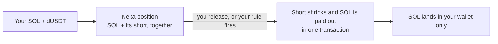
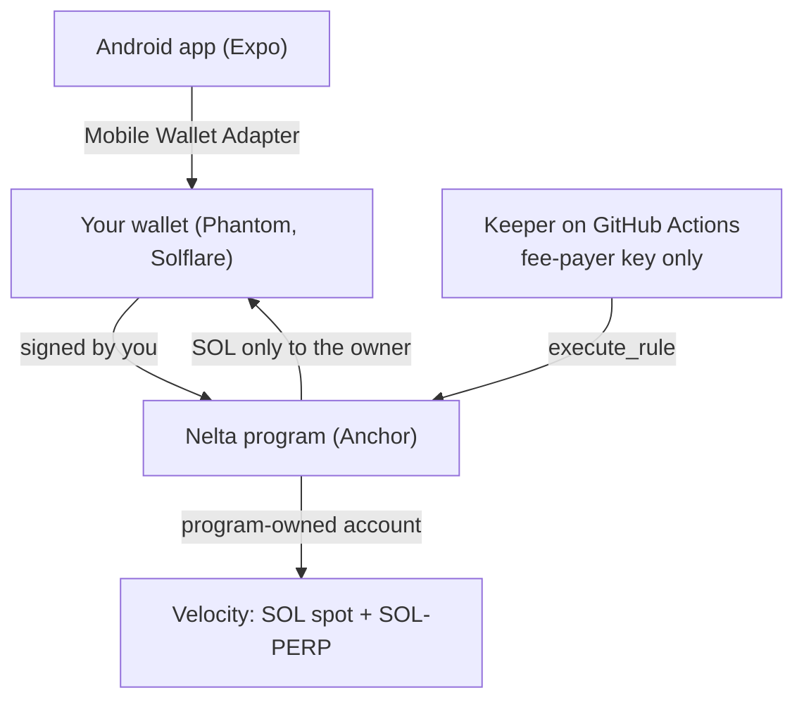

# Nelta

**Nelta keeps your SOL and its hedge together.** Protect your SOL against a price drop, and take SOL out without your protection going wrong.

Download: [nelta.apk (Android, 1.3.2)](https://github.com/CryptoZephyr/nelta/releases/download/v1.3.2/nelta.apk) · [Release notes](https://github.com/CryptoZephyr/nelta/releases/tag/v1.3.2) · Video: not available yet · Docs: this README and [Devnet evidence](docs/devnet-evidence.md) · Built for: Solana Mobile CLOCK IN


Built with: Solana Mobile Wallet Adapter · Velocity (SOL-PERP) · Anchor · Expo / React Native
Status: working Android app and program on **Solana Devnet** (test funds only)

## The problem

Many SOL holders protect themselves against a price drop with a **hedge**: a bet that SOL goes down, sized to the SOL they hold. If SOL falls, the bet gains about what their SOL loses.

The trouble starts when they take some SOL out. The SOL and the bet live in two separate places, and nothing ties them together:

- You hold **0.10 SOL** and protect half of it with a **0.05 SOL** bet against SOL.
- You take out **0.04 SOL** to spend. You now hold 0.06 SOL.
- Your bet is still 0.05 SOL. Half of 0.06 is 0.03, so 0.02 SOL of it no longer protects anything. **It's now a plain bet against SOL that you never chose.** If SOL goes up, you lose on it.

To fix it, you have to remember to shrink the bet yourself, at the right size, every time you move SOL. Miss it, do it late, or have one side fail, and you hold the wrong position. Worse, if you want this to happen at a price ("take out SOL if it hits $210"), you have to be at your phone when it happens.

## What Nelta does

- **One position, two parts.** Your SOL and its hedge (the short) live in the same program-controlled Velocity account. Releases keep your chosen hedge ratio intact.
- **Take SOL out in one step.** Release some SOL and the short shrinks by the matching amount in the same transaction. If either part can't happen, nothing happens.
- **Set one rule, then put your phone away.** For example: "If SOL hits $210, take out 0.04 SOL." A keeper carries it out without the app running. It only works once, and you can cancel it any time.
- **Leave in one tap.** "Keep my SOL, close the hedge" or "Release all, close the hedge". Either one also cancels an armed rule.
- **See your safety margin.** Home estimates how far SOL can move before Velocity would liquidate the short. If something is wrong, it says "Needs attention".
- **Your SOL only ever comes back to you.** No one else can receive it, not the keeper and not Nelta. You can close everything yourself, without the app.

## Words you'll see in the app

| In the app | What it means |
| --- | --- |
| **Hedge** | Your protection against SOL's price falling. It's a bet that SOL goes down, sized to your SOL, so when SOL drops the bet gains about what your SOL loses. |
| **Hedge 25 / 50 / 75 / 100%** | How much of your SOL you want to protect. At 50%, the short aims to offset about half your SOL's price change once it fills. Saving the percentage doesn't open or resize the short; **Sync hedge** does that. 100% isn't risk-free: fees and funding still apply. |
| **SOL-PERP short** | The actual bet behind the hedge, a "perpetual futures" position on Velocity that gains when SOL falls. |
| **SOL in custody** | The SOL you put into Nelta. It's held by the Nelta program, and only you can take it out. |
| **dUSDT collateral** | A test stablecoin kept on Velocity as a safety deposit for the short. Nelta mints 100 test dUSDT for you in one tap. |
| **Sync hedge** | Resize the short so it matches your SOL and chosen %, for example after adding SOL. |
| **Release** | Take SOL out to your wallet. The short shrinks by the matching amount in the same step. |
| **Fill / "Velocity didn't fill"** | The trade on Velocity has to go through completely. If it can't right now, your position stays unchanged. An unsuccessful transaction that reached Devnet can still cost a network fee. |
| **Waiting for Velocity** | Nelta checks the market before opening your wallet. Once a check succeeds, it asks you to approve. The market can change before the approved trade reaches it. |
| **Check before retrying** | Nelta doesn't yet know whether the transaction landed. Check Activity or the Explorer receipt before trying again. |
| **Margin headroom** | How far SOL's price can rise before Velocity would force-close your short. More is safer. You can put in any amount of SOL, but the more SOL you hedge on the same dUSDT, the less headroom you have. For a big deposit, tap **Get 100 test dUSDT** a few more times. |
| **Rule (Armed)** | One instruction you set ahead of time, like "if SOL hits $210, take out 0.04 SOL". It runs once, then switches off. |
| **Keeper** | A small robot that watches the price and runs your rule without the app running. It can only send SOL to you. |
| **Needs attention** | Something changed outside Nelta (for example Velocity closed part of the short). Check Home, then sync or exit. |
| **Recovery** | Three steps to take everything back yourself, even without the keeper. Recovery sets the target to 0% and sends a close order. The short stays open until Velocity fills that order. |

## How it works

1. Connect your wallet (Phantom, Solflare, any Mobile Wallet Adapter wallet) on Devnet.
2. Tap **Get 100 test dUSDT** (collateral for the short, one approval), add SOL, and pick how much to hedge (25–100%).
3. Tap **Sync hedge**. Nelta waits for a fillable check, asks your wallet to approve, and tries to open the matching SOL-PERP short on Velocity. It shows an Explorer receipt when confirmed.
4. Take SOL out yourself, or arm a one-use rule and let the keeper do it while you're away.



## Why Solana

- **Atomic:** the short reduction and the SOL payout are one Solana transaction. Velocity's full-fill orders either fill completely or the whole thing reverts, so the position can't end up half done.
- **Program-owned custody:** the Velocity account belongs to a Nelta program address, not to a person. The rules in the program are the only way to move funds.
- **Mobile Wallet Adapter:** every owner action is signed in your own wallet app on the phone. The keeper never holds your key.

## Try it on Android

1. On an Android phone, download [nelta.apk 1.3.2](https://github.com/CryptoZephyr/nelta/releases/download/v1.3.2/nelta.apk) and install over your existing Nelta without uninstalling. If Chrome stalls at 100%, use Samsung Internet or Firefox.
2. In Phantom: **Settings → Developer settings → Testnet mode → Solana Devnet**. Turn off Android **Power saving**, and unlock Phantom before you approve.
3. Get some free Devnet SOL from the [faucet](https://faucet.solana.com) (about 0.2 SOL is plenty).
4. Open Nelta, tap **Connect wallet**, and follow the steps on Home: create position → get test dUSDT (Nelta mints it for you) → add the SOL amount you choose → sync hedge. Adding SOL doesn't give you dUSDT or open a hedge. Each confirmed transaction shows "Confirmed on Devnet" with an Explorer link.
5. During Sync hedge, expect **Waiting for Velocity** before a wallet prompt. Devnet fills can take time, require several approvals or fail completely. If you see **Check before retrying**, check Activity first.

No phone? Earlier successful runs have transaction links in [docs/devnet-evidence.md](docs/devnet-evidence.md). The latest audit's results and limits are summarized below.

## What's new in 1.3.2

- **Clearer setup.** Get test dUSDT first, then add the SOL amount you choose. Funds takes you back to Home so you can sync the hedge.
- **The target and the actual hedge are clearer.** Home explains what your percentage aims to offset. If a small deposit rounds below Velocity's trade size, setup stays incomplete and suggests adding SOL or choosing a higher percentage.
- **A zero target doesn't hide an open short.** Recovery can leave a close order waiting. Home says the short is still open until its actual size reaches zero.
- **More honest waiting and error messages.** A successful market check doesn't guarantee a fill. Failed transactions sent to Devnet can cost a fee. Keeper check-ins don't guarantee a rule will execute, and a stale price doesn't stop an open short from following the market.

The APK's version, signature and existing signing lineage were verified. **This polish has not been exercised on an Android emulator or a real phone.** Real-wallet compatibility and reliable Velocity fills remain open checks; see [Evidence](#evidence).

### Previous update: 1.3.1

- **Wait before approving.** Nelta checks whether Velocity can fill before opening your wallet. A good check can still miss by the time you approve, so repeated approvals remain possible.
- **Clearer wallet handling.** Declined approvals and expired connections are recognized correctly. A compatibility fix aimed at Phantom is included, but real Phantom and Solflare still need checking on a phone.
- **Clearer transaction results.** Brief network failures are retried, confirmation has a time limit, and a lost send response leads to **Check before retrying**, because the transaction might already have landed.
- **Recovery turns off armed rules.** Even with no short open, Recovery cancels an armed rule before calling that step done. Both named exits also cancel rules.
- **Activity loads and names transactions correctly.** Entries identify deposits, rules, releases and keeper actions.
- **Old prices stop looking fresh.** A cached price keeps aging during a network outage; unsafe release review is blocked.

The latest audit did **not** complete the full hedge flow: Velocity rejected the hedge orders. The app fixes do not guarantee liquidity on its Devnet market. See [Evidence](#evidence) for what passed and what remains unproven.

## What's running

| What | Where |
| --- | --- |
| Nelta program (Devnet) | `9Rk99npYk6kwtEx7MVuq2SWyr1WQQ7f9S9i8mXY4iJ4R` |
| Velocity program (Devnet) | `vELoC1audYbSYVRXn1vPaV8Axoa9oU6BYmNGZZBDZ1P` |
| Hosted keeper | GitHub Actions ([keeper.yml](.github/workflows/keeper.yml)), fee-payer `7kCrKbJ9hAjLFdY26HY5asutdJ4XYadZKajYbu1diqTx` |
| Android app | [1.3.2 on GitHub Releases](https://github.com/CryptoZephyr/nelta/releases/tag/v1.3.2), package `xyz.nelta.app`, version code `6`. The app shows an "Update" banner when a new version is out |

There is **no separate API server or central database**. The app reads Solana directly through RPC, the program enforces custody and permissions, and GitHub Actions hosts the keeper.

## Evidence

### Release checks: 1.3.2, 10 October 2026

- **Passed:** app lint, typecheck and all **33 tests**, plus [app, program and scripts CI](https://github.com/CryptoZephyr/nelta/actions/runs/38041637945). The new regression test checks a zero target with an open short, a partly closed short and final closure.
- **Signed APK:** the [release workflow](https://github.com/CryptoZephyr/nelta/actions/runs/38041653814) built and published version **1.3.2**, version code **6**. The downloaded APK's signature and old-key lineage match the existing release key. Its SHA-256 matches GitHub's asset digest: `915038edd71b38e19e2c63574852ce927248aaebc1bb4ef233c03af2cc366f96`.
- **Not tested in this release pass:** installing or running 1.3.2 on Android, real Phantom/Solflare approvals, or a new hedge-and-exit run. The earlier emulator audit below remains the latest functional audit.

See [the polish changes](https://github.com/CryptoZephyr/nelta/pull/25) and [release notes](https://github.com/CryptoZephyr/nelta/releases/tag/v1.3.2).

### Latest functional audit: 7–8 October 2026

The fixes in 1.3.1 were exercised in signed test builds **test.13** and **test.15**, using an Android emulator and the Solana Mobile test wallet. These results are not proof that real Phantom or Solflare passed.

- **Passed in test.13:** declined signatures, invalid payloads, expired-authorization recovery, waiting before approval, stale-price blocking and a keeper rule executed while the app was force-stopped. Setup and a user-entered **0.043211110 SOL** deposit were confirmed in earlier audit builds.
- **Passed in test.15:** Recovery canceled an armed rule even with no short; Keep SOL, a partial release, Release All and collateral withdrawal each confirmed with one approval. Activity showed owner and keeper transactions and opened the keeper's finalized receipt.
- **Important limit:** those test.15 exits had **zero short**. They do not prove closing or releasing an open hedge in this final run.
- **Failed to fill:** the 25% hedge exhausted ten approvals. The 50%, 75% and 100% attempts also failed with Velocity's inventory/full-fill error. The latest audit therefore did **not** pass the full positive hedge lifecycle.
- **Checks:** 32 app tests, typecheck and lint passed. CI covers the Rust program, app and scripts. Sixteen forbidden-action Devnet checks passed, mostly through simulation.
- **Still untested:** real Phantom and Solflare on this version, a real liquidation, and exhaustive network-failure and transaction-interruption timings.

See [the audited changes and build details](https://github.com/CryptoZephyr/nelta/pull/24). Selected final-audit receipts:

| Action | Devnet receipt |
| --- | --- |
| Keeper executed with the app stopped | [Finalized transaction](https://explorer.solana.com/tx/5Ky2Vs9V8Nh4v6gcLswQbeyz3VgZBQDZDoE9JxEhoywJptSWLf2Epi54ABrRjaxQayL5HUrHbJYTdWJFd3KFF2h5?cluster=devnet) |
| Recovery revoked the armed rule | [Transaction](https://explorer.solana.com/tx/3TekZidmcdakbd43NAsGj8mTStdtaerkQ7nY1Js8j9arzQSR9NU2jvyeRpTAG3etQ6hfJif9r8f1xyBvBwck8k4m?cluster=devnet) |
| Keep SOL with zero short | [Transaction](https://explorer.solana.com/tx/3BDBA45Qugf6cciAEA2wjngkXm6U5iEvHsehTXpZUdqKANvfsQwwsWr9KTv7GVDwegUNEdFD9VFnwRd6C6YJ16hJ?cluster=devnet) |
| Release All with zero short | [Transaction](https://explorer.solana.com/tx/HaoWUGLc6SYndYq7cuao9KUKnVyhJFspQkqk7chCrdmadfRuVHCfCZYTzJh2PNSg9ZB3eKyLH1UjvUG4bkoYHAf?cluster=devnet) |
| Collateral withdrawal | [Transaction](https://explorer.solana.com/tx/3SEVfwqDfun1oagjyp7jR4UdqQ9RnLGipoGmGhZyqxnSRmtf4Qx1pfUnk75a1x8HErFXXKkAvyc2CF1Sm2duNGMY?cluster=devnet) |

### Earlier proof

Earlier builds completed the full lifecycle (create, fund, hedge, rule, keeper, release and recovery), with signatures in [docs/devnet-evidence.md](docs/devnet-evidence.md). Phantom also connected and signed on a real Samsung phone in an earlier version. Neither establishes that the newest wallet changes work on that phone.

## What we tested when things go wrong

| Situation | What should happen | What happened |
| --- | --- | --- |
| Velocity can't fill right now | Your position stays unchanged | Sent failures reverted; unsigned or unsent attempts spent no network fee |
| Keeper tries to pay itself | Rejected | `InvalidRecipient` |
| Rule replayed or used after expiry | Rejected | `StaleNonce` / `RuleExpired` |
| App killed mid-fill | Reload the chain state on reopen | Earlier build preserved the position; latest interruption timings are not exhaustively tested |
| Two taps on Approve | One request | Previously checked in the app; current code guards concurrent requests |
| Network down | Keep the last reading, let its price age | Test.13 showed stale-price "Needs attention" and blocked release review |
| Wallet refuses without signing | Allow a safe retry | Test-wallet declines and invalid payloads recognized in test.13 |
| Authorization expired | Ask for fresh authorization | Test.13 recovered with the test wallet |
| Network drops after sending | Don't offer a blind retry | Uncertain results say "Check before retrying"; unit checks and selected UI checks passed, exhaustive fault timing remains untested |
| Wallet has no SOL for fees | Say so before asking to sign | "Your wallet needs Devnet SOL first" + faucet link |
| Price older than 30 s, or more than 5 s in the future | Rule won't fire | Enforced in the program and covered by tests |
| Rule armed, but no short open | Recovery must still cancel the rule | Test.15 revoked it before marking the step done |
| Target is 0%, but a short remains open | Say the short is still open until it closes | 1.3.2 unit test passed for an open short, partial closure and zero; Android rendering not tested |
| RPC rejects batched history reads | Activity still loads | Test.15 populated Activity using individual reads |

## Architecture



| Part | What it does |
| --- | --- |
| `programs/nelta` | Custody rules: paired release, rebalance, one-use rules, owner recovery |
| `app/` | Android app: welcome, Home, rule, release, funds, recovery, activity |
| `scripts/` | Devnet lifecycle scripts and the stateless keeper (`worker.ts`) |
| `.github/workflows` | CI, the hosted keeper, and the signed APK release |

## Program rules (for reviewers)

- **Paired release** (`release`, `execute_rule`): in one instruction, reduce the short to `floor(remaining_sol * ratio / 10_000 / step) * step` with a `FullFill` market order, withdraw the SOL, and pay it only to the owner's wSOL account. If the fill is incomplete, the whole transaction reverts. The app unwraps it to native SOL in the same transaction. Keeper-run rules pay wSOL.
- **Rebalance** (owner only): move the short to the same target for the SOL held. The ratio is capped at 100%.
- **One-use rule**: the owner arms `(trigger price, above/below, release amount, expiry)`. Any keeper can run it once, with a fresh oracle (at most 30 s old), the matching nonce, and before expiry. It can only shrink the hedge and pay the owner. The owner can revoke it at any time.
- **Owner recovery**: `set_ratio(0)`, then `reduce_hedge` (a reduce-only resting order that Velocity keepers fill), `release` and `withdraw_collateral`. None of these need the app or the keeper.

## Run locally

Program (Rust, Solana CLI 4.x with platform tools 1.57, Anchor CLI 1.0.2):

```bash
cargo test
cd programs/nelta && cargo-build-sbf --sbf-out-dir ../../target/deploy -- --features no-log-ix-name
anchor idl build -o target/idl/nelta.json
```

Devnet lifecycle (`NELTA_OWNER_KEYPAIR` and `NELTA_KEEPER_KEYPAIR` point to keypair files that are never committed; `RPC_URL` should be a private Devnet RPC):

```bash
cd scripts && npm ci
npx tsx src/e2e.ts init      # position + Velocity account owned by it
npx tsx src/e2e.ts fund      # 60 dUSDT collateral + 0.1001 SOL
npx tsx src/e2e.ts hedge     # 50% short
npx tsx src/e2e.ts negative  # attacks that must fail
npx tsx src/d10extra.ts      # more forbidden actions
npx tsx src/e2e.ts arm       # arm a rule, then the owner process exits ("phone off")
npm run worker               # keeper runs it
npx tsx src/e2e.ts recover   # owner closes everything
```

App:

```bash
cd app && npm ci
npx tsc --noEmit && npx expo lint && npm test
npx expo run:android
```

**Hosted keeper:** [keeper.yml](.github/workflows/keeper.yml) runs about 6 hours at a time and a schedule starts the next run. It needs the repo secrets `NELTA_KEEPER_KEYPAIR` (fee-payer only, it can't move user funds) and `RPC_URL` (a private Devnet RPC).

**Android releases:** pushing a `vX.Y.Z` tag builds, signs and publishes `nelta.apk`. See [app/RELEASING.md](app/RELEASING.md).

## Limitations

- **Devnet only, with test funds.** A functional and code audit has been performed; no independent security audit has been done.
- **Fills are not guaranteed.** Waiting before approval reduces unnecessary prompts, but Velocity can become unfillable before the trade lands. A hedge action can still exhaust ten approvals. Failed transactions leave your position unchanged but can cost network fees.
- **Newest real-wallet compatibility remains unverified.** Phantom and Solflare need testing on a real phone with this release.
- **1.3.2's polish has build and unit-test evidence only.** It hasn't had a new Android UI or hedge-and-exit run.
- **Keeper uptime:** the free GitHub Actions keeper has short gaps of a few minutes between runs.
- **You connect your wallet again each time you open the app.**
- **Android only.** The APK is installed directly, not from a store.
- **No demo video yet.**

## Roadmap

- Demo video and a 5-person user test.
- Solana dApp Store listing.
- Several rules per position (today: one at a time).

## Security

Found a security problem? Please report it privately, see [SECURITY.md](SECURITY.md).

## License

[MIT](LICENSE)
